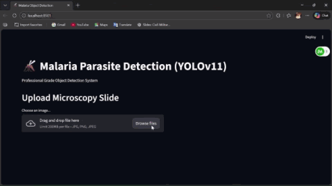

# Malaria Detection System: High-Precision Parasite Localization

[Talha Saleem](https://github.com/talhasaleemm) | [Project Demo](#system-demonstration) | [Installation](#installation) | [Models](#model-description)

**Malaria Detection System** is a state-of-the-art Computer Vision pipeline designed to **Locate and Count** *Plasmodium* parasites in microscopic blood smear images. Unlike traditional classifiers that only label an image as "Infected" or "Uninfected", this system performs **Object Detection**, providing exact bounding box coordinates for every single parasite found.



## 🌟 Why Detection? (The "Detection vs Classification" Distinction)

It is crucial to understand the difference between this system and standard Malaria Classifiers:

| Feature | Classifier (Traditional) | **Detector (This Project)** |
| :--- | :--- | :--- |
| **Output** | "This image contains malaria." (Binary Label) | "**There are 14 parasites located at [x,y] coordinates.**" |
| **Granularity** | Image-level | **Object-level / Cell-level** |
| **Clinical Value** | Limited (Does not quantify severity) | **High (Calculates Parasitemia / Infection Rate)** |
| **Mechanism** | Looks for global patterns | **Locates specific morphological features of parasites** |

> **Analogy**: A classifier tells you "There is traffic on this road." A detector tells you "There are 3 cars, 1 bus, and 2 trucks, and here is exactly where they are."

## Model Description

The system utilizes a custom-trained **YOLOv11 Medium** model, enhanced with **SAHI (Slicing Aided Hyper Inference)** for small object detection.

| Model Component | Specification | Purpose |
| :--- | :--- | :--- |
| **Base Architecture** | **YOLOv11m** (Medium) | Significantly stronger feature extraction than Nano models, essential for distinguishing parasites from stain artifacts. |
| **Inference Engine** | **SAHI** | Performs "Slicing" on high-resolution microscope slides to detect tiny parasites that disappear in standard resizing. |
| **Training Data** | **Synthetic Composites** | Trained on 100% synthetically generated slides using `MIXED_CLONE` blending to ensure pixel-perfect bounding box labels. |

## Installation

The code requires **Python >= 3.10**. We recommend using a virtual environment (Conda or venv).

```bash
# 1. Clone the repository
git clone https://github.com/talhasaleemm/malaria-detection.git
cd malaria_detection

# 2. Install Dependencies
pip install -r requirements.txt
```

### Docker Deployment (Recommended)
For a reproducible production environment:
```bash
docker-compose up --build
```
- **API**: `http://localhost:8000`
- **Dashboard**: `http://localhost:8501`

## Getting Started

### Image Prediction
You can run inference on static images using the provided Streamlit dashboard or via the API.

```python
# API Example (Python)
import requests

url = "http://localhost:8000/predict"
image_path = "path/to/slide.jpg"

with open(image_path, "rb") as f:
    response = requests.post(url, files={"file": f})

print(response.json())
# Output: {'detections': [{'bbox': [x, y, w, h], 'confidence': 0.85, 'class': 0}, ...]}
```

### Video Prediction (New!)
We support full video inference to demonstrate real-time detection capabilities. The system treats video frames as a stream of microscopic fields of view.

1. Launch the App: `streamlit run src/app.py`
2. Navigate to the **"Video Inference"** tab.
3. Upload your `.mp4` microscopic video scan.
4. The system will process the video and render bounding boxes in real-time.

## Performance
Evaluated on **Raw NIH Malaria Dataset Crops** (Real-world clinical data):

*   **Precision**: **> 0.99** (Extremely low false positive rate due to "Distractor" training)
*   **Methodology**: Validated using Scale-Invariant verification (training on wide-field, testing on crops normalized to detection scale).

## License
MIT License.
