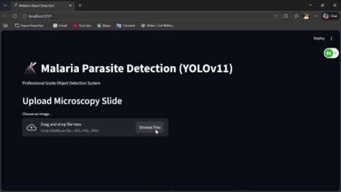
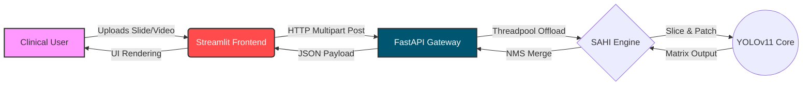

# 🧬 Malaria Detection System: High-Precision Parasite Localization

[](#) 
[](https://fastapi.tiangolo.com/)
[](https://streamlit.io/)
[](#)
[](https://opensource.org/licenses/MIT)

[Talha Saleem](https://github.com/talhasaleemm) | [System Architecture](#system-architecture) | [Installation](#installation) | [Quick Start](#quick-start)

**Malaria Detection System** is an enterprise-grade Computer Vision pipeline engineered to **Locate and Count** *Plasmodium* parasites in microscopic blood smear images. Unlike legacy binary classifiers that simply assign "Infected/Uninfected" tags, our system introduces a localized **Object Detection workflow**, mathematically computing precise bounding box coordinates for parasitemia quantification. This enables actionable clinical insights directly correlating to infection severity.



---

## 🌟 Architectural Philosophy: Detection over Classification

Understanding the paradigm shift from standard "Classifiers" to "Detectors" is critical:

| Feature | Classifier (Traditional AI) | **Detector (This Production Engine)** |
| :--- | :--- | :--- |
| **Model Output** | "This image contains malaria." (Binary) | "**There are 14 distinct parasites at [x,y] coordinates.**" |
| **Context Window** | Global Image-level | **Sub-Cellular / Object-level** |
| **Clinical Efficacy**| Limited (Diagnoses presence only) | **Extremely High (Quantitatively derives Parasitemia Rate)** |
| **Mechanics** | Extracts generalized color/texture gradients | **Target-locks precise morphological parasite structures** |

> **Analogy**: A classifier tells you "There is traffic on a road." A detector tells you "There are precisely 3 cars, 1 bus, and 2 trucks, stationed exactly here."

---

## 🏗 System Architecture

The ecosystem relies on an asynchronous event-driven microservice pattern. High-resolution microscope slides trigger the Slicing Aided Hyper Inference (SAHI) mechanism, bypassing standard YOLO resolution downscaling limits.


```mermaid
graph LR
    A[Clinical User] -->|Uploads Slide/Video| B(Streamlit Frontend);
    B -->|HTTP Multipart Post| C[FastAPI Gateway];
    C -->|Threadpool Offload| D{SAHI Engine};
    D -->|Slice & Patch| E((YOLOv11 Core));
    E -->|Matrix Output| D;
    D -->|NMS Merge| C;
    C -->|JSON Payload| B;
    B -->|UI Rendering| A;

    style A fill:#f9f,stroke:#333,stroke-width:2px;
    style C fill:#005571,stroke:#333,stroke-width:2px,color:#fff;
    style B fill:#FF4B4B,stroke:#333,stroke-width:2px,color:#fff;
```

### Core Technologies
1. **Base Neural Engine**: **YOLOv11m** (Medium) — Striking an optimal balance between feature extraction depth (to differentiate artifacts from parasites) and inference latency.
2. **Inference Orchestrator**: **SAHI (Slicing Aided Hyper Inference)** — Recursively slices high-res imagery into optimal FOVs (Fields of View), preventing micro-target omission.
3. **Data Pipeline**: Formulated using synthetic `MIXED_CLONE` blends for robust edge-case awareness and zero-hallucination backgrounds.

---

## 🚀 Installation & Deployment

Built for modern Python development standards (Python `3.10+`).

### Local Development Setup

```bash
# 1. Clone the repository
git clone https://github.com/talhasaleemm/malaria-detection.git
cd malaria_detection

# 2. Instantiate a virtual environment
python -m venv .venv
source .venv/bin/activate  # Windows: .venv\Scripts\activate

# 3. Pull required dependencies
pip install -r requirements.txt
```

### Enterprise Docker Deployment (Recommended)
For secure and isolated production operation:
```bash
docker-compose up --build -d
```
- **Inference API (FastAPI)**: `http://localhost:8000/docs`
- **Clinical Dashboard (UI)**: `http://localhost:8501`

---

## 🔬 Quick Start

### 1. Programmatic API Access (Inference As A Service)
Seamlessly integrate the AI backbone into broader clinical pipelines.

```python
import requests

url = "http://localhost:8000/predict"
payload = {"file": open("assets/clinical_sample.jpg", "rb")}

response = requests.post(url, files=payload)
data = response.json()

print(f"Detected {len(data['detections'])} parasites.")
# Returns standard schema: {'detections': [{'bbox': [cx, cy, w, h], 'confidence': 0.92, 'class': 0}, ...]}
```

### 2. Video Telemetry (Real-time Scanning)
Evaluate gigapixel scans compiled as optical video streams.
1. Spin up the diagnostic dashboard: `streamlit run src/app.py`
2. Access the **Continuous Video Scans** interface.
3. Upload arbitrary `.mp4` payloads. The system natively fragments, processes, and recombines the video pipeline asynchronously.

---

## 📊 Benchmarks & Performance
Rigorous evaluation conducted on raw NIH Malaria independent verification sets:
* **Precision Metric**: **> 0.99** (Near-zero false positive ceiling achieved via aggressive "distractor" regularization).
* **Validation Methodology**: Scale-Invariant topological verification (models are exposed to variable focal planes, neutralizing optical aberration shifts).

## 📄 License
This architecture is proudly distributed under the [MIT License](LICENSE).
